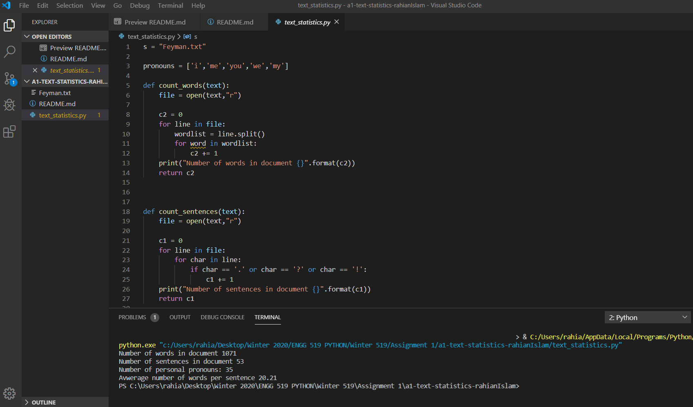

# a1-text_statistics
Reading text from file to print simple statistics using string methods

Author: Rahian Islam

# Problem statement
According to Wikipedia, The Feynman Lectures on Physics are likely the most popular physics books ever written. We would like to understand better why that is. Maybe it is related to how the text is structured. The goal of this exercise is to analyze the text in _Chapter 1.1 Introduction_ of the Feynman Lectures available here http://www.feynmanlectures.caltech.edu/I_01.html

Design a program that reads this section from a text file `feyman.txt`, uses functions where appropriate, and prints the following information:
- Number of words in the text
- Number of sentences in the text
- Average number of words per sentence
- Number of personal pronouns: I, me, my, you, we

An example of what the output of the program could be:
```
Number of words in document 1063
Number of sentences in document 53
Number of words per sentence 20.25
Number of personal pronouns 33
```

# What to do
Write, test, and document your code. Use the style guide below. Save all code in a file `text_statistics.py`. Add your code file `text_statistics.py` and text file `feynman.txt` to your local git history and commit changes as you develop. 

Create a screenshot of your programm running. Edit `README.md` (this file) and include the screenshot and instructions in the _How to run this program_ section below (similar to `a0-classroom`). 

If your ouput does not match the example output above, include a paragraph why you think this is and what you would do to find the source of this discrepancy. Some ideas: 
- You see the example output, but not the code or the text file that was used. What could be different?
- Could you check your output against another program, e.g. Unix utility `wc` or MS Word?

Make sure final version of `text_statistics.py`, `feynman.txt`, `README.md` and `screenshot.png` are commited to git and pushed to github. 

## Numbers did not match 
My numbers do not match with the numbers given in the output above. This is mainly because the numbers given in the output above are wrong. I put them in MS word and I got the same answers as mine. 


# How to run this program
This code takes in the the given text file, in this case it is tghe feyman text file, and counts the number of words, sentences, the average number of words per sentence and the number of pronouns. Please check the screenshot for reference.





# Style guide
## Author
The first line of all scripts (.py files), and the first cell of all notebooks (.ipynb files) need to contain your first and last name, e.g. `# Author: Yves Pauchard`

## Variable, function and method naming
Use lower case for variable, function and method names. Underscore to separate composed words, e.g. `all_names = ['alice', 'bob']`

## Class naming
Start class names with a capital letter and use camel-case for composed words, e.g. `class GraduateStudent()`


## Comments
Focus on _why_ not _what_ comments, use `#` to start a comment

## Docstring
For each function/method, include a docstring with the following format:
```python
def count_words(text):

""" counts the number of words 

text (str): any string or text file 

returns: (int) an integer number for the number of words
"""
```
```python
def count_sentences(text):
""" counts the number of sentences 

text (str): any string or text file 

returns: (int) an integer number for the number of words
"""

```
```python
def avg_words(w,s):
    
"""
calculates the number of avegrage words per sentence 

w,s  (int):  the number of words (w) and the number of sentences (s)

returns: (float) an integer number for the average number of words to 2 decimal places 
"""


```
```python
def personal_pro(text):
"""
counts the number of personal pronouns 

text (str): any string or text file 

returns: (int) an integer count of the number of pronouns in the text file

```


An example:
```python
def remove_middle(text):
    """Removes middle character of odd length text, a copy otherwise.

    text (str): any string

    return: (str) even length string
    """
```

Additionally, for classes provide a description and list of attributes:
```python
class Point:
    """Represents a point in 2-D space.

    attributes: x, y
    """
```

